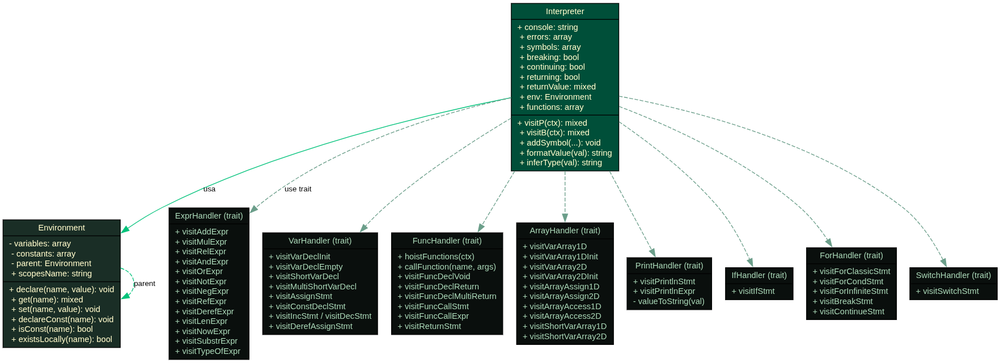
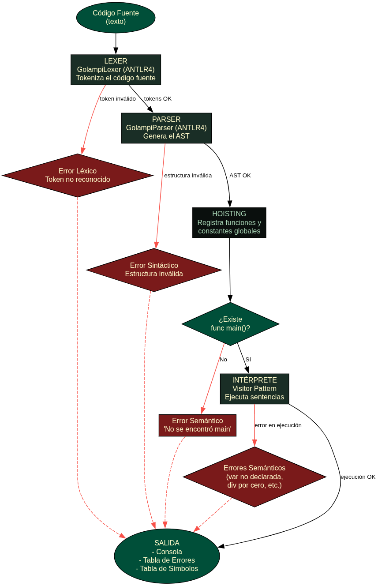
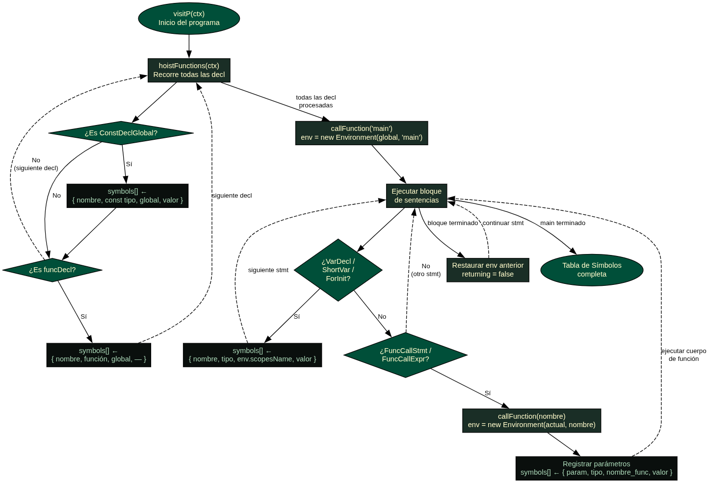

# Documentación Técnica — Golampi Interpreter

**Universidad San Carlos de Guatemala**

**Organización de Lenguajes y Compiladores 2**

**Estudiante:** René Gutiérrez

**Carné:** 202300540

**Proyecto:** Proyecto 1 — Intérprete 
Golampi

---

## 1. Gramática Formal de Golampi

La gramática de Golampi es un subconjunto del lenguaje Go, definida en ANTLR4 con target PHP. Describe todas las construcciones válidas del lenguaje que el intérprete puede reconocer y ejecutar.

---

### 1.1 Programa

El punto de entrada de la gramática. Un programa Golampi es una secuencia de **declaraciones** (`decl`) seguidas del fin de archivo (`EOF`). Las declaraciones pueden ser funciones o constantes globales. No existe código "suelto" fuera de una función — todo debe estar encapsulado.

```
programa    ::= decl* EOF

decl        ::= funcDecl
              | 'const' ID type '=' expr ';'?
```

---

### 1.2 Declaración de Funciones

Una función se compone de la palabra reservada `func`, un nombre, una lista opcional de parámetros entre paréntesis, un tipo de retorno opcional y un bloque de sentencias. Golampi soporta tres variantes:

- **Sin retorno** (`FuncDeclVoid`): la función no devuelve ningún valor, como `func main()`.
- **Con retorno simple** (`FuncDeclReturn`): devuelve un único valor de un tipo específico.
- **Con retorno múltiple** (`FuncDeclMultiReturn`): devuelve dos o más valores simultáneamente, cada uno con su propio tipo.

Los parámetros pueden ser de tipo simple, arreglo 1D, arreglo 2D o puntero a cualquiera de ellos.

```
funcDecl    ::= 'func' ID '(' params? ')' bloque
              | 'func' ID '(' params? ')' returnType bloque
              | 'func' ID '(' params? ')' '(' returnType (',' returnType)* ')' bloque

params      ::= param (',' param)*

param       ::= ID type
              | ID arrayType1D type
              | ID arrayType2D type
              | ID '*' type
              | ID '*' arrayType1D type
              | ID '*' arrayType2D type

returnType  ::= type
              | arrayType1D type
              | arrayType2D type
```

---

### 1.3 Bloque

Un bloque es una secuencia de sentencias delimitada por llaves `{ }`. Define un nuevo ámbito léxico — las variables declaradas dentro de un bloque solo existen dentro de él.

```
bloque      ::= '{' stmt* '}'
```

---

### 1.4 Sentencias

Las sentencias son las instrucciones ejecutables del lenguaje. Golampi soporta una amplia variedad:

- **Declaración de variables:** con tipo explícito (`var`) o inferido (`:=`), con o sin valor inicial, incluyendo arreglos 1D y 2D.
- **Declaración de constantes:** valor inmutable que no puede modificarse después de su declaración.
- **Asignaciones:** simple (`=`) y compuestas (`+=`, `-=`, `*=`, `/=`, `++`, `--`).
- **Punteros:** asignación por desreferenciación (`*ID = expr`).
- **Arreglos:** asignación por índice en 1D y 2D.
- **Impresión:** `fmt.Println` con cero o más argumentos.
- **Control de flujo:** `if/else`, `for` (tres variantes), `switch/case/default`.
- **Funciones:** llamada a funciones definidas por el usuario.
- **Retorno:** `return` con cero, uno o más valores.
- **Control de ciclos:** `break` y `continue`.

```
stmt        ::= 'var' ID arrayType1D type '=' arrayLit1D ';'?
              | 'var' ID arrayType1D type ';'?
              | 'var' ID arrayType2D type '=' arrayLit2D ';'?
              | 'var' ID arrayType2D type ';'?
              | 'var' ID type '=' expr ';'?
              | 'var' ID type ';'?
              | 'var' ID (',' ID)+ type '=' expr (',' expr)* ';'?
              | 'const' ID type '=' expr ';'?
              | ID ':=' expr ';'?
              | ID ':=' arrayLit1D ';'?
              | ID ':=' arrayLit2D ';'?
              | ID (',' ID)+ ':=' expr (',' expr)* ';'?
              | ID '=' expr ';'?
              | ID '+=' expr ';'?
              | ID '-=' expr ';'?
              | ID '*=' expr ';'?
              | ID '/=' expr ';'?
              | ID '++' ';'?
              | ID '--' ';'?
              | '*' ID '=' expr ';'?
              | ID '[' expr ']' '=' expr ';'?
              | ID '[' expr ']' '[' expr ']' '=' expr ';'?
              | 'fmt.Println' '(' (expr (',' expr)*)? ')' ';'?
              | ID '(' (expr (',' expr)*)? ')' ';'?
              | 'if' expr bloque ('else' bloque)?
              | 'for' forInit? ';' expr? ';' forPost? bloque
              | 'for' expr bloque
              | 'for' bloque
              | 'switch' expr? '{' switchCase* '}'
              | 'return' (expr (',' expr)*)? ';'?
              | 'break' ';'?
              | 'continue' ';'?

forInit     ::= 'var' ID type '=' expr
              | ID ':=' expr

forPost     ::= ID '++'
              | ID '--'
              | ID '=' expr

switchCase  ::= 'case' expr ':' stmt*
              | 'default' ':' stmt*
```

---

### 1.5 Expresiones

Las expresiones producen un valor. Golampi soporta literales, variables, acceso a arreglos, llamadas a funciones, operadores y funciones embebidas. La precedencia de operadores (de menor a mayor) es:

1. `||` — OR lógico
2. `&&` — AND lógico
3. `==`, `!=` — igualdad
4. `<`, `>`, `<=`, `>=` — relacionales
5. `+`, `-` — suma y resta
6. `*`, `/`, `%` — multiplicación, división y módulo
7. `!`, `-` (unario), `&`, `*` (puntero) — mayor precedencia

El operador `&&` implementa **corto circuito**: si el operando izquierdo es `false`, el derecho no se evalúa. De igual forma `||` no evalúa el derecho si el izquierdo es `true`.

```
expr        ::= INT_LIT
              | FLOAT_LIT
              | BOOL_LIT
              | STRING_LIT
              | RUNE_LIT
              | 'nil'
              | ID
              | ID '[' expr ']'
              | ID '[' expr ']' '[' expr ']'
              | ID '(' (expr (',' expr)*)? ')'
              | 'fmt.Println' '(' (expr (',' expr)*)? ')'
              | 'len' '(' expr ')'
              | 'now' '(' ')'
              | 'substr' '(' expr ',' expr ',' expr ')'
              | 'typeOf' '(' expr ')'
              | '(' expr ')'
              | '-' expr
              | '!' expr
              | '&' ID
              | '*' ID
              | expr ('*' | '/' | '%') expr
              | expr ('+' | '-') expr
              | expr ('<' | '>' | '<=' | '>=') expr
              | expr ('==' | '!=') expr
              | expr '&&' expr
              | expr '||' expr
```

---

### 1.6 Tipos

Los tipos describen el conjunto de valores que puede tomar una variable. Golampi tiene tipos primitivos y tipos derivados (punteros). Los arreglos se expresan con su propia sintaxis separada para evitar ambigüedades en el parser.

```
type        ::= 'int32'
              | 'int'
              | 'float32'
              | 'bool'
              | 'rune'
              | 'string'
              | '*' type

arrayType1D ::= '[' INT_LIT ']'
arrayType2D ::= '[' INT_LIT ']' '[' INT_LIT ']'
```

---

### 1.7 Literales de Arreglo

Los literales de arreglo permiten inicializar un arreglo con valores en el momento de su declaración. Los arreglos 2D se componen de filas (`arrayRow`), cada una es una lista de expresiones entre llaves. Se permite una coma final (`','?`) para facilitar el formato multilínea.

```
arrayLit1D  ::= '[' INT_LIT ']' type '{' (expr (',' expr)*)? '}'
arrayLit2D  ::= '[' INT_LIT ']' '[' INT_LIT ']' type
                  '{' (arrayRow (',' arrayRow)* ','?)? '}'
arrayRow    ::= '{' (expr (',' expr)*)? '}'
```

---

### 1.8 Tokens

Los tokens son las unidades mínimas reconocidas por el lexer. Los comentarios de una línea (`//`) y de bloque (`/* */`) son ignorados completamente mediante la directiva `skip`.

```
INT_LIT         ::= [0-9]+
FLOAT_LIT       ::= [0-9]+ '.' [0-9]+
BOOL_LIT        ::= 'true' | 'false'
STRING_LIT      ::= '"' (~["\r\n\\] | '\\' .)* '"'
RUNE_LIT        ::= '\'' (~['\\] | '\\' .) '\''
ID              ::= [a-zA-Z_][a-zA-Z0-9_]*

LINE_COMMENT    ::= '//' ~[\r\n]* -> skip
BLOCK_COMMENT   ::= '/*' .*? '*/' -> skip
WS              ::= [ \t\r\n]+ -> skip
```

---

## 2. Arquitectura del Intérprete

### 2.1 Diagrama de Clases

```
┌─────────────────────────────────────────────────────────┐
│                      Interpreter                         │
│  + console: string                                       │
│  + errors: array                                         │
│  + symbols: array                                        │
│  + breaking: bool                                        │
│  + continuing: bool                                      │
│  + returning: bool                                       │
│  + returnValue: mixed                                    │
│  + env: Environment                                      │
│  + functions: array                                      │
│─────────────────────────────────────────────────────────│
│  usa traits:                                             │
│    ExprHandler, PrintHandler, VarHandler, IfHandler,     │
│    ForHandler, FuncHandler, SwitchHandler, ArrayHandler  │
└─────────────────┬───────────────────────────────────────┘
                  │ usa
          ┌───────▼────────┐
          │  Environment   │
          │────────────────│
          │ + variables    │
          │ + constants    │
          │ + parent       │
          │ + scopesName   │
          │────────────────│
          │ + declare()    │
          │ + get()        │
          │ + set()        │
          │ + declareConst │
          │ + isConst()    │
          └────────────────┘        
```


  

### 2.2 Traits del Intérprete

| Trait | Responsabilidad |
|-------|----------------|
| `ExprHandler` | Evaluación de expresiones, operadores, built-ins |
| `PrintHandler` | Manejo de `fmt.Println` |
| `VarHandler` | Declaración y asignación de variables y constantes |
| `IfHandler` | Sentencias `if/else` |
| `ForHandler` | Sentencias `for` (clásico, while, infinito) |
| `FuncHandler` | Declaración, hoisting y llamada de funciones |
| `SwitchHandler` | Sentencias `switch/case/default` |
| `ArrayHandler` | Arreglos 1D y 2D, acceso y modificación |

---

## 3. Flujo de Procesamiento

### 3.1 Diagrama de Flujo General

```
Código fuente
      │
      ▼
┌─────────────┐
│   Lexer     │  GolampiLexer (ANTLR4)
│  (tokens)   │  ──→ Errores léxicos
└──────┬──────┘
       │
       ▼
┌─────────────┐
│   Parser    │  GolampiParser (ANTLR4)
│   (AST)     │  ──→ Errores sintácticos
└──────┬──────┘
       │
       ▼
┌─────────────┐
│ Interpreter │  Visitor Pattern
│ (ejecución) │  ──→ Errores semánticos
└──────┬──────┘
       │
       ▼
┌─────────────────────┐
│  Salida + Reportes  │
│  - Consola          │
│  - Tabla errores    │
│  - Tabla símbolos   │
└─────────────────────┘
```


### 3.2 Flujo de la Tabla de Símbolos

```
hoistFunctions()
      │
      ├── registra funciones globales → symbols[]
      └── registra constantes globales → symbols[]
            │
            ▼
      callFunction('main')
            │
            ├── crea Environment(parent, 'main')
            ├── registra parámetros → symbols[]
            │
            └── ejecuta bloque
                  │
                  ├── visitVarDeclInit/Empty → symbols[]
                  ├── visitShortVarDecl → symbols[]
                  ├── visitForShortInit → symbols[]
                  └── callFunction('otraFuncion')
                        │
                        └── crea Environment(parent, 'otraFuncion')
                              └── registra parámetros → symbols[]
```


### 3.3 Manejo de Ámbitos (Scopes)

Cada `Environment` contiene una referencia a su padre, formando una cadena. Cuando se busca una variable, se recorre la cadena desde el scope actual hasta el global. Al entrar a una función se crea un nuevo `Environment` con el nombre de la función como `scopesName`, y al salir se restaura el scope anterior.

---

## 4. Funciones Embebidas

| Función | Descripción | Ejemplo |
|---------|-------------|---------|
| `fmt.Println(...)` | Imprime valores separados por espacio + salto de línea | `fmt.Println("x:", 10)` |
| `len(x)` | Longitud de string o arreglo | `len("Hola")` → `4` |
| `now()` | Fecha y hora actual `YYYY-MM-DD HH:MM:SS` | `now()` |
| `substr(s, i, n)` | Subcadena desde índice `i` con longitud `n` | `substr("Hola", 0, 2)` → `"Ho"` |
| `typeOf(x)` | Tipo de una variable como string | `typeOf(3.14)` → `"float32"` |

---

## 5. Manejo de Errores

### Tipos de Error

| Tipo | Color | Descripción |
|------|-------|-------------|
| Léxico | Amarillo | Token no reconocido por el lexer |
| Sintáctico | Rojo | Estructura inválida según la gramática |
| Semántico | Verde | Error en tiempo de ejecución |

### Errores Semánticos Detectados

- Variable no declarada
- Constante modificada
- Función no declarada
- Función `main` invocada explícitamente
- División por cero
- Índice fuera de rango en arreglos
- `len()` aplicado a tipo no soportado
- `substr()` con índices inválidos

---

*OLC2 — Proyecto 1, Ciclo 1 2026*