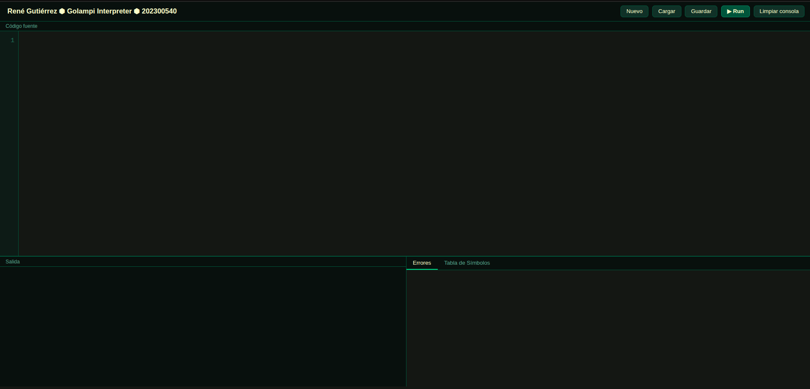
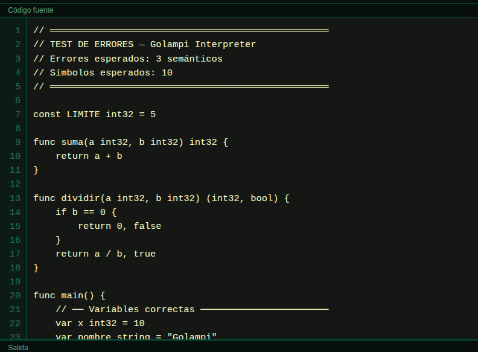
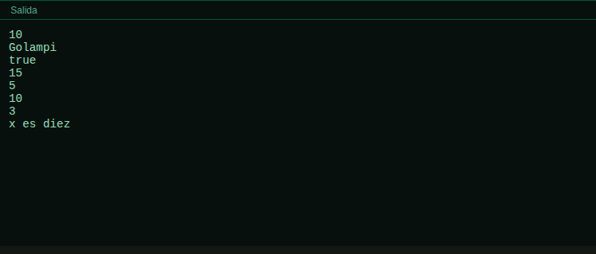
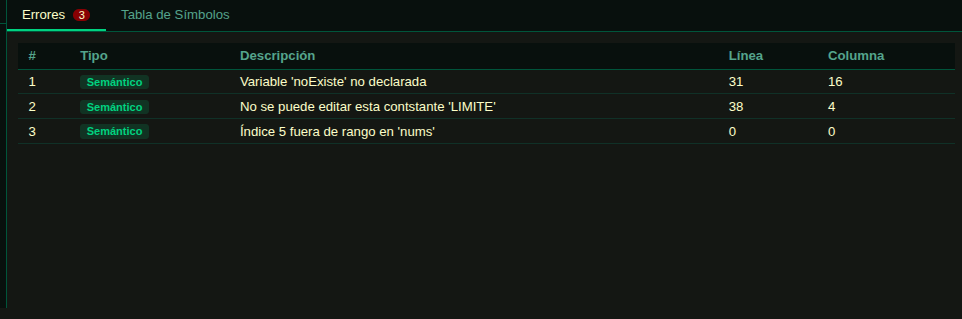
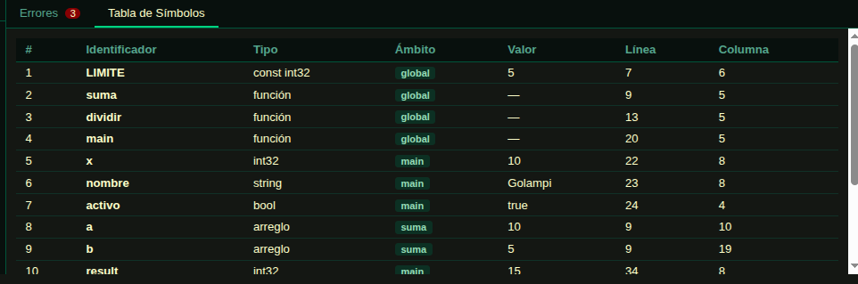
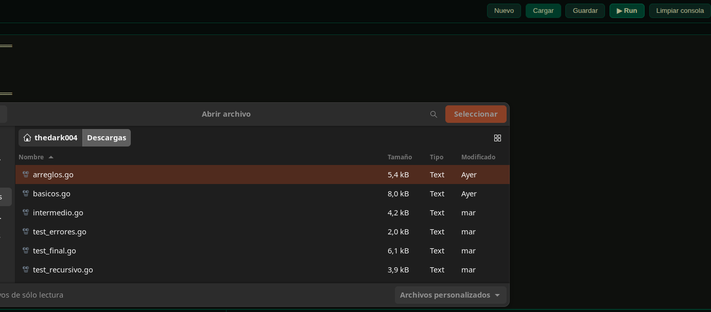
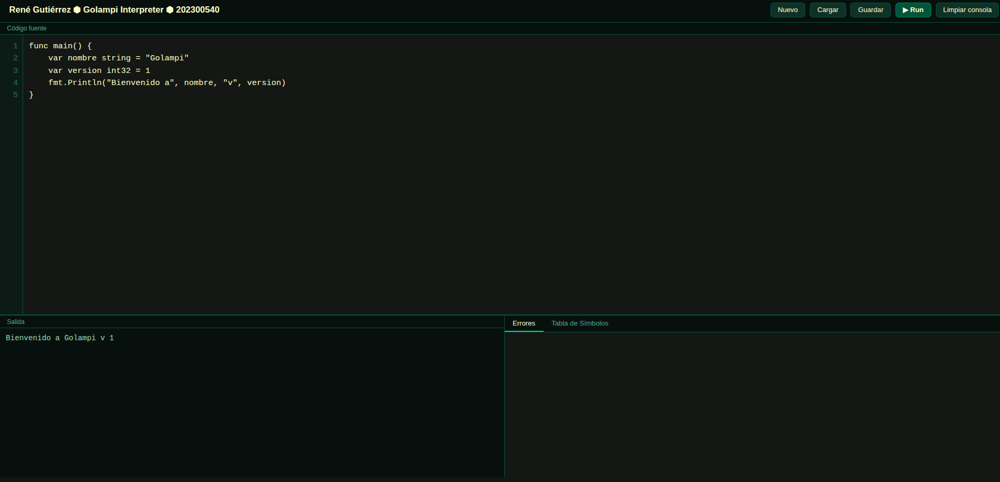
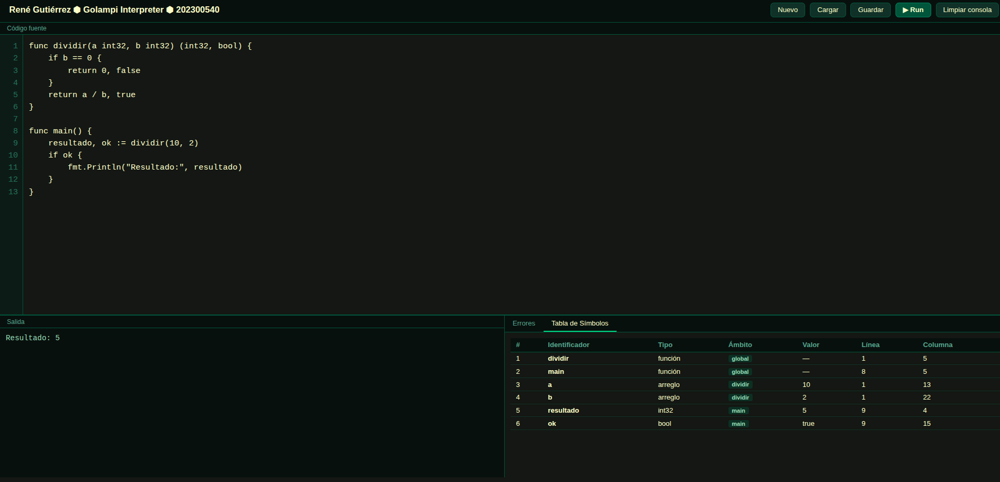
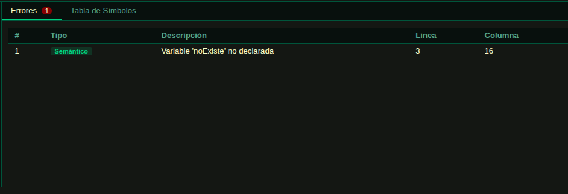

# Manual de Usuario — Golampi Interpreter

**Universidad San Carlos de Guatemala**
**Organización de Lenguajes y Compiladores 2**
**Estudiante:** René Gutiérrez
**Carné:** 202300540

---

## 1. Requisitos del Sistema

| Requisito | Versión |
|-----------|---------|
| PHP | 8.1 o superior |
| Java | 11 o superior (para ANTLR4) |
| ANTLR4 | 4.13 o superior |
| Composer | 2.x |
| Navegador | Chrome, Firefox, Edge (moderno) |

---

## 2. Instalación

### 2.1 Clonar el Repositorio

```bash
git clone https://github.com/usuario/OLC2_PROYECTO1_202300540.git
cd OLC2_PROYECTO1_202300540
```

### 2.2 Instalar Dependencias PHP

```bash
composer install
```

Esto instala la librería `antlr/antlr4-php-runtime` en la carpeta `vendor/`.

### 2.3 Regenerar el Parser (opcional)

Si se modifica la gramática `Golampi.g4`, regenerar los archivos ANTLR:

```bash
antlr4 -Dlanguage=PHP Golampi.g4 -visitor -o src/
```

### 2.4 Iniciar el Servidor

```bash
php -S localhost:8000
```

Abrir el navegador en: **http://localhost:8000/index.php**

---

## 3. Interfaz de Usuario

La interfaz se divide en tres secciones principales: la barra de herramientas (navbar), el editor de código y el panel inferior con la consola y los reportes.



### 3.1 Barra de Herramientas (Navbar)

La barra superior contiene el nombre del estudiante, el título del intérprete y los botones de acción.

| Botón | Función |
|-------|---------|
| **Nuevo** | Limpia el editor para comenzar desde cero |
| **Cargar** | Abre un archivo `.go` o `.golampi` desde el sistema |
| **Guardar** | Descarga el código del editor como archivo |
| **Limpiar consola** | Borra la salida de la consola |
| **▶ Run** | Ejecuta el código Golampi |

### 3.2 Editor de Código

El editor ocupa la parte central de la pantalla. Cuenta con números de línea sincronizados, fuente monoespaciada y soporte para scroll horizontal y vertical.



### 3.3 Consola de Salida

Muestra la salida estándar del programa ejecutado. El texto aparece en color verde claro sobre fondo oscuro. Las secuencias de escape como `\n` y `\t` son interpretadas correctamente.



### 3.4 Panel de Reportes — Pestaña Errores

Muestra todos los errores encontrados durante la ejecución, clasificados por tipo con colores diferenciados.



| Columna | Descripción |
|---------|-------------|
| # | Número de error |
| Tipo | Léxico / Sintáctico / Semántico (con color) |
| Descripción | Mensaje descriptivo del error |
| Línea | Línea donde ocurrió el error |
| Columna | Columna donde ocurrió el error |

### 3.5 Panel de Reportes — Pestaña Tabla de Símbolos

Muestra todos los identificadores registrados durante la ejecución, incluyendo su tipo, ámbito y valor.



| Columna | Descripción |
|---------|-------------|
| # | Número de símbolo |
| Identificador | Nombre de la variable/función/constante |
| Tipo | Tipo de dato o `función` |
| Ámbito | Scope donde fue declarado (global, main, nombreFunción) |
| Valor | Valor actual del identificador |
| Línea | Línea de declaración |
| Columna | Columna de declaración |

---

## 4. Crear y Ejecutar Código

### 4.1 Escribir Código

Haz clic en el editor y escribe tu programa Golampi. Todo programa válido debe tener una función `main`:

```go
func main() {
    fmt.Println("Hola, Golampi!")
}
```

### 4.2 Cargar un Archivo

1. Haz clic en el botón **Cargar**
2. Selecciona un archivo `.go` o `.golampi` desde tu computadora
3. El contenido se cargará automáticamente en el editor



### 4.3 Ejecutar el Programa

1. Escribe o carga tu código en el editor
2. Haz clic en el botón **▶ Run**
3. La salida aparecerá en la **Consola de Salida**
4. Los errores aparecerán en la pestaña **Errores**
5. Los símbolos se poblarán en la pestaña **Tabla de Símbolos**


### 4.4 Guardar el Código

1. Haz clic en el botón **Guardar**
2. El navegador descargará el archivo como `programa.golampi`

---

## 5. Ejemplos de Sesión de Uso

### 5.1 Programa Básico

**Código:**
```go
func main() {
    var nombre string = "Golampi"
    var version int32 = 1
    fmt.Println("Bienvenido a", nombre, "v", version)
}
```

**Salida esperada:**
```
Bienvenido a Golampi v 1
```



---

### 5.2 Funciones con Retorno Múltiple

**Código:**
```go
func dividir(a int32, b int32) (int32, bool) {
    if b == 0 {
        return 0, false
    }
    return a / b, true
}

func main() {
    resultado, ok := dividir(10, 2)
    if ok {
        fmt.Println("Resultado:", resultado)
    }
}
```

**Salida esperada:**
```
Resultado: 5
```



---

### 5.3 Ejemplo con Errores

**Código:**
```go
func main() {
    var x int32 = 10
    fmt.Println(noExiste)
}
```

**Tabla de Errores:**

| # | Tipo | Descripción | Línea | Columna |
|---|------|-------------|-------|---------|
| 1 | Semántico | Variable 'noExiste' no declarada | 3 | 16 |



---

## 6. Sintaxis del Lenguaje Golampi — Referencia Rápida

### 6.1 Variables

```go
var x int32 = 10          // declaración larga con valor
var y float32             // declaración larga sin valor (default 0)
z := 42                   // declaración corta
var a, b int32 = 1, 2     // declaración múltiple
const PI float32 = 3.14   // constante
```

### 6.2 Tipos de Dato

| Tipo | Descripción | Valor por Defecto |
|------|-------------|-------------------|
| `int32` / `int` | Entero 32 bits | `0` |
| `float32` | Flotante 32 bits | `0.0` |
| `bool` | Booleano | `false` |
| `string` | Cadena de texto | `""` |
| `rune` | Carácter (valor ASCII) | `0` |

### 6.3 Estructuras de Control

```go
// If / Else
if condicion {
    // ...
} else {
    // ...
}

// For clásico
for i := 0; i < 10; i++ { }

// For while
for x > 0 { }

// For infinito
for { break }

// Switch
switch variable {
case 1:
    // ...
default:
    // ...
}
```

### 6.4 Arreglos

```go
var arr [5]int32               // arreglo vacío
var mat [3][3]int32            // matriz vacía
arr2 := [3]int32{1, 2, 3}     // arreglo inicializado
arr[0] = 10                    // asignación
fmt.Println(arr[0])            // acceso
fmt.Println(len(arr))          // longitud
```

### 6.5 Punteros

```go
func incrementar(n *int32) {
    *n = *n + 1
}

func main() {
    var x int32 = 5
    incrementar(&x)
    fmt.Println(x)  // 6
}
```

---

## 7. Solución de Problemas Comunes

| Problema | Causa | Solución |
|----------|-------|----------|
| "No se encontró la función main" | Falta la función `main` | Asegúrate de tener `func main() { }` |
| Error sintáctico en línea 0 | La gramática no reconoce la construcción | Revisa la sintaxis del código |
| Salida vacía sin errores | El código no tiene `fmt.Println` | Agrega sentencias de impresión |
| "Variable 'x' no declarada" | Uso antes de declarar | Declara la variable antes de usarla |
| División por cero | Divisor es `0` | Valida el divisor antes de dividir |

---

*Manual de Usuario — OLC2 Proyecto 1, Ciclo 1 2026*
